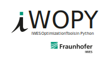

# iwopy

Fraunhofer IWES optimization tools in Python



## Overview

The `iwopy` package is in fact a meta package that provides interfaces to other open-source Python optimization packages out there. Currently this includes

- [pymoo](https://pymoo.org/index.html)
- [pygmo](https://esa.github.io/pygmo2/index.html)
- (more to come with future versions)

`iwopy` can thus be understood as an attempt to provide *the best of all worlds* when it comes to solving optimization problems with Python. This has not yet been achieved, since above list of accessable optimization packages is obviously incomplete, but it's a start. All the credit for implementing the invoked optimizers goes to the original package providers.

The basic idea of `iwopy` is to provide abstract base classes, that can be concretized for any kind of problem by the users, and the corresponding solver interfaces. However, also some helpful problem wrappers and an original optimizer are provided in addition:

- Problem wrapper `LocalFD`: Calculates derivatives by finite differences
- Problem wrapper `RegularDiscretizationGrid`: Puts the problem on a Grid
- Optimizer `GG`: *Greedy Gradient* optimization with constraints

All calculations support vectorized evaluation of a complete population of parameters. This is useful for heuristic approaches like genetic algorithms, but also for evaluating gradients. It can lead to a vast speed-up and should be invoked whenever possible. Check the examples (or the API) for details.

Documentation: [https://fraunhoferiwes.github.io/iwopy.docs/index.html](https://fraunhoferiwes.github.io/iwopy.docs/index.html)

Source code: [https://github.com/FraunhoferIWES/iwopy](https://github.com/FraunhoferIWES/iwopy)

PyPi reference: [https://pypi.org/project/iwopy/](https://pypi.org/project/iwopy/)

Anaconda reference: [https://anaconda.org/conda-forge/iwopy](https://anaconda.org/conda-forge/iwopy)

## Requirements

The supported Python versions are:

- `Python 3.7`
- `Python 3.8`
- `Python 3.9`
- `Python 3.10`
- `Python 3.11`

## Installation via conda

The `iwopy` package is available on the channel [conda-forge](https://anaconda.org/conda-forge/iwopy). You can install the latest version by

```console
conda install -c conda-forge iwopy
```

## Installation via pip

### Virtual Python environment

We recommend working in a Python virtual environment and install `iwopy` there. Such an environment can be created by

```console
python -m venv /path/to/my_venv
```

and afterwards be activated by

```console
source /path/to/my_venv/bin/activate
```

Note that in the above commands `/path/to/my_venv` is a placeholder that should be replaced by a path to a (non-existing) folder of your choice, for example `~/venv/iwopy`.

All subsequent installation commands via `pip` can then be executed directly within the active environment without changes. After your work with `iwopy` is done you can leave the environment by the command `deactivate`.

### Standard users

As a standard user, you can install the latest release via [pip](https://pypi.org/project/iwopy/) by

```console
pip install iwopy
```

This in general corresponds to the `main` branch at [github](https://github.com/FraunhoferIWES/iwopy). Alternatively, you can decide to install the latest pre-release developments (non-stable) by

```console
pip install git+https://github.com/FraunhoferIWES/iwopy@dev#egg=iwopy
```

### Developers

The first step as a developer is to clone the `iwopy` repository by

```console
git clone https://github.com/FraunhoferIWES/iwopy.git
```

Enter the root directory by

```console
cd iwopy
```

Then you can either install from this directory via

```console
pip install -e .
```

## Contributing

1. Fork _iwopy_ on _github_.
2. Create a branch (`git checkout -b new_branch`)
3. Commit your changes (`git commit -am "your awesome message"`)
4. Push to the branch (`git push origin new_branch`)
5. Create a pull request [here](https://github.com/FraunhoferIWES/iwopy/pulls)
