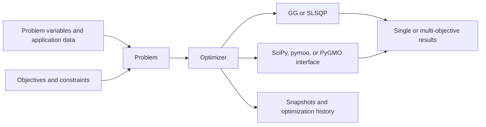

# iwopy Architecture

## Purpose

This document is the durable technical map of iwopy, the Fraunhofer IWES
optimization tools in Python. iwopy is an established in-process library for
defining optimization problems, objectives, constraints, derivatives, callbacks,
pipelines, and optimizer integrations. It is not an application scaffold and it
does not own a particular scientific domain.

Use [naming conventions](naming-conventions.md) for domain vocabulary, types,
array shapes, and identifiers. Use [docstring conventions](docstrings.md) for
public Python documentation and [development](development.md) for setup,
quality gates, test selection, documentation builds, and navigation. Record the
reason for a consequential change in an [ADR](adr/README.md).

## Authoritative Sources

When sources disagree, use this order:

1. `AGENTS.md` and any applicable scoped repository instructions
2. Accepted ADRs in `docs/adr/`, for decisions within those policies
3. This architecture document and `docs/naming-conventions.md`
4. Public contracts and configuration in `iwopy/` and `pyproject.toml`
5. Tests that exercise the contract
6. Examples, notebooks, and external references

Code and tests establish current runtime behavior and can expose documentation
drift, but they do not silently replace a documented durable decision. Resolve
the conflict and update the record in the same change.

## System Context

iwopy serves developers, researchers, and engineers who need one problem model
across native optimizers and external solver libraries. A caller defines a
`Problem`, adds objective and constraint functions, selects an `Optimizer`, and
receives an iwopy result container. Interfaces translate the same problem into
SciPy, pymoo, or PyGMO contracts.

- Runtime: Python 3.10 through 3.14 on operating-system-independent Python
	environments.
- Required scientific stack: NumPy, SciPy, and matplotlib.
- Optional optimizer integrations: pymoo and PyGMO, selected through package
	extras. The `opt` and `test` extras aggregate supported solver integrations.
- iwopy is an in-process library. It has no application server, authentication
	boundary, persistent database, browser frontend, or package console script.
- External optimizer adapters own translation to backend variable, constraint,
	callback, and result conventions. Core problems remain backend-independent.

## Primary Execution Flow

1. Construct a `Problem` and declare integer and floating optimization variables.
2. Construct objectives and constraints and add them before problem
	initialization.
3. Initialize the problem, which fixes function/component metadata and variable
	mappings.
4. Construct and initialize an optimizer for the problem.
5. Call `solve(callbacks=...)`; the optimizer evaluates individuals or
	populations through the problem contract.
6. Solver implementations finalize selected individuals or populations through
	the problem before constructing the result container. Optionally call
	`optimizer.finalize(opt_results)` afterward to print the result summary.

Examples may use `SimpleProblem` and simple functions to define compact callable
problems, or wrappers such as `LocalFD` and `DiscretizeRegGrid` to adapt an
existing problem. Those paths still use the same core lifecycle.

## Module Boundaries

| Module | Owns | Main interfaces and dependencies |
|---|---|---|
| `iwopy.core` | Base lifecycle, problems, functions, memory, optimizers, callbacks, results, and pipelines | `Base`, `Problem`, `OptFunction`, `Objective`, `Constraint`, `Optimizer`, result containers, `Pipeline` |
| `iwopy.wrappers` | Reusable adaptations of problems and functions | `SimpleProblem`, `SimpleObjective`, `SimpleConstraint`, `ProblemWrapper`, `LocalFD`, `DiscretizeRegGrid` |
| `iwopy.interfaces.scipy` | Translation to SciPy optimization methods | SciPy optimizer adapter, bounds, constraints, callbacks, and Jacobians |
| `iwopy.interfaces.pymoo` | Single- and multi-objective pymoo integration | Mixed/integer/float representations, algorithm factories, population evaluation, result conversion |
| `iwopy.interfaces.pygmo` | Serial PyGMO integration | UDP translation, algorithms, fitness/batch fitness, callbacks, and result conversion |
| `iwopy.optimizers` | Native iwopy optimizer implementations | `GG` and `SLSQP`; depends on core contracts and SciPy mathematics |
| `iwopy.benchmarks` | Reusable analytical example problems | Branin and Rosenbrock problem definitions |
| `iwopy.utils` | Shared discretization, loading, subclass discovery, and output suppression | `RegularDiscretizationGrid` and focused infrastructure helpers |
| `examples` and `notebooks` | Executable public workflows | Public APIs and declared optimizer extras |
| `tests` | Core, optimizer, backend, package, and callback-example coverage | May inspect internals only when the internal contract itself is under test |

The package root exposes `Problem`, `Objective`, `Constraint`, `Memory`, pipeline
and callback APIs, wrappers, and the principal subpackages. Lower-level
`Optimizer`, `OptFunction`, and optimization result classes are curated through
`iwopy.core`. Internal helpers do not become public merely because another
module imports them.

## Runtime Contracts

### Lifecycle And Registration

Core lifecycle-aware objects derive from `Base`. Initialize them before
evaluation or solving, and finalize them when resources or mutable problem state
must be released. `Base.finalize()` resets initialization state. Optimizer
callbacks instead implement their own `initialize`, `notify`, and `finalize`
protocol without deriving from `Base`.

Add objectives and constraints before problem initialization. Function lists
reject later additions because variable mappings, component names, bounds, and
counts are fixed by initialization. Optimizers verify that both optimizer and
problem are initialized before solving.

`ProblemWrapper.initialize()` shares and rebinds the underlying problem's
function lists to the wrapper. It is an adapter, not an independent deep copy;
document and test mutations that callers can observe through either object.

### Variables, Individuals, And Populations

iwopy separates integer and floating-point optimization variables:

- One individual uses `vars_int` with shape `(n_vars_int,)` and `vars_float`
	with shape `(n_vars_float,)`.
- A population uses `(n_pop, n_vars_int)` and `(n_pop, n_vars_float)`.
- A missing variable family uses a zero-width array, including for populations;
	the population axis is not omitted.
- Integer unbounded limits use `Problem.INT_INF` sentinels. Floating bounds use
	positive or negative `np.inf`.

Variable names and order are public. A function receives only its mapped
problem variables, in the function's declared order. Maps may use names,
indices, or uniquely matching patterns; ambiguous or missing matches are input
errors.

### Evaluation And Memory

Individual and population evaluation first applies variables to the problem,
then maps variables into each function and calculates objective and constraint
components. Evaluation returns `(objs, cons)` or
`(objs, cons, problem_results)` when application results are requested.
Finalization returns `(problem_results, objs, cons)`; preserve this distinct
ordering.

Objective values use `(n_objectives,)` for an individual and
`(n_pop, n_objectives)` for a population. Constraint values follow the same rule
with `n_constraints`. These counts refer to scalar components, not the number of
function objects.

Optional `Memory` caches objective and constraint values by variable assignment.
An evaluation requesting application-specific `problem_results` bypasses cached
lookup because those results are not reconstructed from cached function values.
Cache changes require tests for key identity, copying, and individual/population
equivalence.

### Functions, Bounds, And Feasibility

`OptFunction` is the shared function contract; `Objective` adds optimization
direction and `Constraint` adds component bounds and tolerances. Function lists
concatenate components in registration order.

Constraint bounds are component-wise. The default contract is
`-np.inf <= value <= 0.0` with tolerance `1e-5`. Feasibility checks both lower
and upper bounds with tolerance; a finite calculation is not necessarily a
feasible one.

Each `Constraint` is the sole owner of its scalar tolerance. `Problem` does not
cache a second tolerance vector. Backends that require component-wise values
expand the registered constraints in function/component order when their
adapter initializes. Native SLSQP applies those tolerances to its translated
bounds, while zero tolerance requests exact bounds. See
[ADR-0003](adr/0003-constraint-owned-solver-tolerances.md).

Simple objectives and constraints expose `f(*x)` and optional analytical
gradient `g()`. Integer function arguments precede floating arguments. Keep the
callable convention aligned with the function's variable mapping.

### Derivatives

`ana_deriv()` returns selected-component derivatives for one floating variable.
Unavailable analytical values use `NaN`, allowing the gradient assembler to
distinguish them from exact zero. Dependency masks identify structurally
independent component/variable pairs.

`Problem.get_gradients()` returns shape
`(n_selected_components, n_selected_float_variables)`. It assembles analytical
values, zeros independent entries, and rejects unresolved `NaN` values. Default
combined-function gradients order objective components before constraint
components.

`LocalFD` supplies numerical derivatives for wrapped functions, with bounded
finite-difference population batches where configured. Numerical wrapping must
preserve the original component and variable order.

### Results And Callbacks

`SingleObjOptResults` represents one selected solution. Variable, objective, and
constraint arrays can be absent when a backend fails to produce them.
`MultiObjOptResults` represents a Pareto population with leading `n_pop`; its
success array marks feasibility per candidate. Both containers retain variable
and component names and application-specific `problem_results`.

Optimizer callbacks follow `initialize`, ordered `notify`, and `finalize`.
`OptimizerCallbackData` normalizes snapshots to two-dimensional population
arrays, with integer variables stored as `int32` and numeric values as
`float64`. Events distinguish `iteration` and `evaluation`; counters and values
may be unavailable. `OptimizationHistory` records snapshots and plots best
objective values.

### Pipelines

`PipelineStage.run()` accepts `prev_stage`, `prev_results`, verbosity, and stage
parameters, and returns `(success, results)`. Stages own directories named
`NN_stage_name`. `Pipeline.run()` executes the selected half-open stage range,
stops after a failed stage, and optionally finalizes initialized stages. Changes
to result propagation must be tested directly; do not infer pipeline behavior
from a downstream application package.

`Pipeline.run(initial_results=...)` supplies an application-defined restart
payload to the first selected stage. A later-stage restart also identifies the
immediately preceding registered stage without running it. Run cleanup restores
the configured stage range and clears running state after success, a
stage-reported failure, or an exception. See
[ADR-0004](adr/0004-pipeline-restart-results.md).

## Optimizer And Backend Boundaries

### Native Optimizers

`GG` is a constrained local Greedy Gradient optimizer. `SLSQP` uses SciPy with
iwopy gradients and scaling. Both require continuous, single-objective problems.
SLSQP derives and applies component tolerances from the registered constraint
objects. They own optimizer-specific convergence and step behavior, not problem
application semantics.

### SciPy

The SciPy adapter requires one objective, no integer variables, and at least one
floating variable. It translates bounds and constraints, dispatches callbacks,
and supplies iwopy Jacobians to methods that consume gradients. SciPy is a base
dependency, not an optional import.

### pymoo

The pymoo adapter supports pure integer, pure floating, and mixed variable
representations, individual or population execution, and single- or
multi-objective result conversion. Algorithm names resolved by the factory are
public selectors. Constraint conversion and representation changes require
focused adapter tests against supported pymoo versions.

### PyGMO

The PyGMO adapter is serial. Decision vectors place floating variables before
integer variables, while fitness vectors place objectives before constraints;
batch fitness is flattened according to PyGMO's contract. Current finalization
produces a single champion in `SingleObjOptResults`. Do not infer multi-objective
result support from UDP metadata alone.

The PyGMO UDP expands each registered constraint's tolerance into its `c_tol`
vector when the adapter is constructed; the core problem does not own that
backend representation.

pymoo and PyGMO imports are lazy and report installation guidance when their
extras are unavailable. Importing base `iwopy` must not require either package.

## Extension Points

### Problems And Functions

Implement the narrowest core base class. A reusable problem declares variable
names, initial values, bounds, application results, and individual/population
behavior. A function declares component count/names, variable dependencies,
values, and derivatives. Add both individual and population implementations
where the public API advertises vectorization.

### Optimizers And Interfaces

A new optimizer owns solver lifecycle, compatibility validation, callbacks, and
conversion to an iwopy result container. A backend interface remains isolated
under `iwopy.interfaces`; core must not import an optional backend eagerly.
Test backend ordering and failure conversion, not only a successful scalar
example.

### Wrappers

Wrappers adapt an existing public contract. Preserve the wrapped problem's
variable and component identity unless the wrapper explicitly transforms it.
`DiscretizeRegGrid` is the problem wrapper;
`RegularDiscretizationGrid` is its lower-level utility. Keep those concepts
distinct.

## Data And Integration Boundaries

iwopy does not own a persistent database. It receives caller-defined Python
objects, arrays, callables, paths, and backend settings; holds optimization state
in memory; and writes files only through explicit examples, callbacks, pipelines,
or caller code.

- Validate variable maps, shapes, bounds, component selections, backend options,
	and paths at the owning boundary.
- Preserve lower-level exceptions as causes when adding context. Errors should
	identify the problem, function, variable, component, optimizer, backend, or
	stage involved.
- Keep optional backend imports isolated and fail with actionable installation
	guidance.
- Caller application data retains its own classification. Objective inputs,
	constraint data, variable values, and application-specific `problem_results`
	may require the classification question in
	[AGENTS.md](../AGENTS.md#data-classification). Synthetic benchmarks and public
	examples do not authorize inspection of another data set.
- No data-classification exception is currently recorded; see
	[data-classification-exceptions.md](data-classification-exceptions.md).

## Performance And Vectorization

Population evaluation is a primary architectural capability. Preserve leading
population axes and backend ordering instead of looping through candidates solely
for implementation convenience.

- Compare population values with stacked individual values.
- Avoid copying complete populations for each function component when mapped
	views or shared calculations are sufficient.
- Keep memory-cache behavior deterministic and independent of evaluation order.
- Keep analytical Jacobians aligned with selected component and variable order.
- Measure representative variable, population, component, and finite-difference
	batch sizes before accepting a performance optimization.

## Public Interfaces

Public contracts include exported Python classes and functions, lifecycle and
evaluation return ordering, variable and component names/order, array shapes,
bounds/tolerances, callback events/snapshots, result containers, pipeline stage
contracts, wrapper behavior, and backend algorithm selectors.

Compatibility-sensitive means identifying the complete impact and moving all
maintained callers, tests, examples, notebooks, and documentation to the target
contract in one change. It does not imply retaining a legacy path; development
is forward-only by default under
[ADR-0001](adr/0001-forward-only-development.md).

## Cross-Cutting Decisions

- Development is strictly forward-looking by default. Superseded code and
	contracts are removed rather than kept behind compatibility shims; a bounded
	legacy exception requires explicit authorization and a recorded removal
	condition. See [ADR-0001](adr/0001-forward-only-development.md).
- Code changes require focused and full tests. Every change requires full
	pre-commit, affected public docstrings, the current-version final
	`CHANGELOG.md` section, and synchronized iwopy documentation as one completion
	gate. See [ADR-0001](adr/0001-forward-only-development.md).
- `pyproject.toml` is the source of package metadata, supported Python versions,
	dependencies, extras, build configuration, and mypy settings.
- Production Python under `iwopy/` is type checked. Tests, examples, notebooks,
	and docs are not currently part of the mypy target.
- Public Python APIs follow [docstring conventions](docstrings.md): NumPy-style
	docstrings expose optimization, array, lifecycle, and backend contracts while
	types remain in annotations.
- Ruff formatting/linting and mypy run through pre-commit. Pytest is the test
	runner; Sphinx with AutoAPI, numpydoc, and MyST-NB builds the documentation.
- iwopy follows the Fraunhofer corporate design. The repository has no browser
	UI and no design-token adapter; corporate requirements apply to matplotlib
	Pareto/history plots, examples, notebooks, documentation, and brand assets.
	See [ADR-0002](adr/0002-corporate-design.md).
- The repository has no browser UI and no design-token adapter. Its visual
	surface consists of matplotlib Pareto/history plots, examples, notebooks,
	documentation, and brand assets. Visual changes first follow the policy in
	[AGENTS.md](../AGENTS.md#ui-design-policy) and applicable corporate chart
	guidance.

## ADR Triggers

Create or supersede an ADR when a change alters lifecycle or module ownership,
variable/function/result shapes or ordering, bounds and feasibility semantics,
derivative assembly, callback events, pipeline contracts, backend translation,
supported runtime range, dependency strategy, data boundaries, UI design policy,
or a naming rule used across the package. A local implementation change that
preserves these contracts does not need an ADR.
